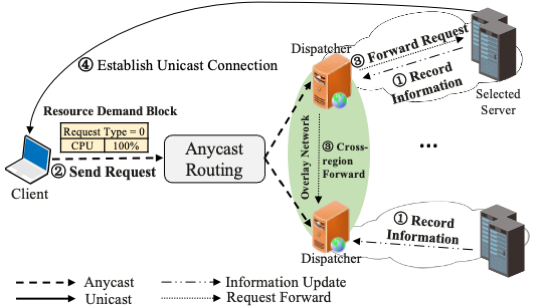
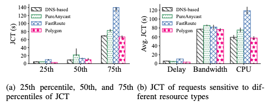

# 1. Introduction to Polygon
As CDN application scenarios expand, except for latency, resource types like bandwidth and CPU are also important for CDN performance. However, mainstream CDN server selection schemes solely consider individual resource types, which fail to select the most appropriate CDN servers when multiple resource requirements are present.

We propose **Polygon**, a CDN server selection system supporting multiple resource demands. The specific resource demands are appended in requests to facilitate resource awareness. The keystone of the awareness of multiple resource types is a set of dispatchers, aiming to select suitable CDN servers and allocate requests. 
Evaluated on real-world datasets, Polygon achieves a median job completion time reduction of up to 54.8% compared to existing solutions. Additionally, it improves bandwidth utilization by 13% and CPU utilization by 7%.

- The workflow of Polygon for CDN server selection

- The job completion time performance comparison of DNS-based, PureAnycast, FastRoutet, and Polygon

> Mengying Zhou, Tiancheng Guo, Yang Chen, Yupeng Li, Meng Niu, Xin Wang, and Pan Hui. "Polygon: A QUIC-Based CDN Server Selection  System Supporting Multiple Resource Demands." IEEE/ACM Transactions on Networking. **(Under Major Revision)**
> 
> A preliminary version of this paper has been published in Middleware'21. [PDF](https://mengyingzhou.github.io/research/Zhou_Polygon_Middleware21.pdf)

# 2. Content of this repo
This repository contains two main parts: the implementation of the prototype and the evaluation-related scripts.

We list the four prototypes, which are:
1. [Polygon](./Polygon/README.md)
2. [DNS-based solution baseline](./DNS_CDN/README.md)
3. [PureAnycast solution baseline](./Polygon/README.md)
4. [FastRoute solution baseline](./FastRoute/README.md)

We have written detailed README documents for all of the above prototypes for reference. Each document includes configuration of the environment required to run the prototype, how to compile the prototype, and the pipeline for evaluating the prototype.
