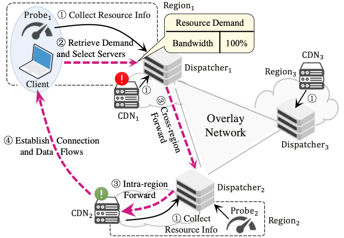

# 1. Introduction to Polygon
CDN is a crucial Internet infrastructure ensuring quick access to Internet content. With the expansion of CDN scenarios, beyond delay, resource types like bandwidth and CPU are also important for CDN performance. Our measurements highlight the distinct impacts of various resource types on different CDN requests. Unfortunately, mainstream CDN server selection schemes only consider a single resource type and are unable to choose the most suitable servers when faced with diverse resource types. To fill this gap, we propose Polygon, a QUIC-powered CDN server selection system that is aware of multiple resource demands. Being an advanced transport layer protocol, QUIC equips Polygon with customizable transport parameters to enable the seamless handling of resource requirements in requests. Its 0-RTT and connection migration mechanisms are also utilized to minimize delays in connection and forwarding. A set of collaborative measurement probes and dispatchers are designed to support Polygon, being responsible for capturing various resource information and forwarding requests to suitable CDN servers. Real-world evaluations on the Google Cloud Platform and extensive simulations demonstrate Polygon’s ability to enhance QoE and optimize resource utilization. The results show up to a 54.8% reduction in job completion time, and resource utilization improvements of 13% in bandwidth and 7% in CPU.

- The workflow of Polygon for CDN server selection

- The job completion time performance comparison of DNS-based, PureAnycast, FastRoutet, and Polygon

> Mengying Zhou, Tiancheng Guo, Yang Chen, Yupeng Li, Meng Niu, Xin Wang, and Pan Hui. "Polygon: A QUIC-Based CDN Server Selection  System Supporting Multiple Resource Demands." IEEE/ACM Transactions on Networking.
> 
> A preliminary version of this paper has been published in Middleware'21. [PDF](https://mengyingzhou.github.io/research/Zhou_Polygon_Middleware21.pdf)

# 2. Content of this repo
This repository contains two main parts: the implementation of the prototype and the evaluation-related scripts.

We list the four prototypes, which are:
1. [Polygon](./Polygon/README.md)
2. [DNS-based solution baseline](./DNS_CDN/README.md)
3. [PureAnycast solution baseline](./Polygon/README.md)
4. [FastRoute solution baseline](./FastRoute/README.md)

We have written detailed README documents for all of the above prototypes for reference. Each document includes configuration of the environment required to run the prototype, how to compile the prototype, and the pipeline for evaluating the prototype.
